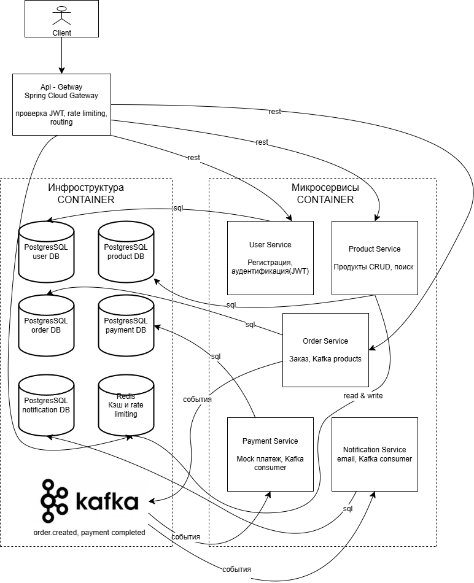

# online-shop-microservices
Проект интернет-магазина на основе микросервисов (Java Spring Boot + Kafka + Redis + Docker). Pet-project for Junior Java Developer resume.
# Проект стартовал!

## Архитектура проекта

### Основные компоненты:
- **API Gateway** (Spring Cloud Gateway) — обработка JWT, Rate Limiting, маршрутизация запросов
- **Микросервисы**: User Service, Product Service, Order Service, Payment Service, Notification Service
- **Database per Service** — каждая микросервис использует свою отдельную базу PostgreSQL
- **Redis** — общий кэш и Rate Limiting
- **Apache Kafka** — event-driven архитектура (`order.created`, `payment.completed` и другие события)

## Используемые технологии
- **Java 21**
- **Spring Boot 3**
- **Spring Cloud Gateway**
- **PostgreSQL** (отдельная БД на каждый сервис)
- **Redis**
- **Apache Kafka**
- **Docker + Docker Compose**

## Основные возможности
- Регистрация и аутентификация пользователей (JWT)
- Просмотр и поиск товаров с кэшированием в Redis
- Создание заказов
- Обработка платежей (mock)
- Асинхронная отправка уведомлений через Kafka

---

**Статус проекта:** В разработке